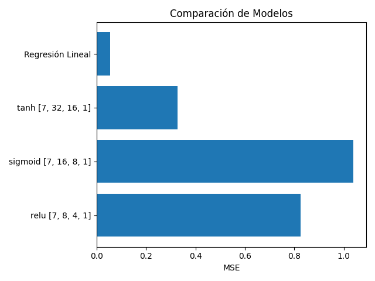

#Tarea: Optimización de Precios con Redes Neuronales

Este proyecto implementa una red neuronal desde cero utilizando únicamente NumPy, con el objetivo de predecir la demanda de productos en función de sus características (precio, categoría, stock, etc.).

## Estructura del Repositorio

```
tarea-redes-neuronales-final/
├── data/
│   └── synthetic_data.csv
├── notebooks/
│   ├── 01_implementacion_red.ipynb
│   ├── 02_experimentacion.ipynb
│   └── 03_analisis_resultados.ipynb
├── src/
│   ├── neural_network.py
│   └── data_preprocessing.py
├── results/
│   ├── demanda_prediccion.png
│   └── architecture_analysis.png
├── requirements.txt
└── README.md
```

## Resultados

Comparación de arquitecturas y activaciones para predicción de demanda (MSE ↓):



- La **Regresión Lineal** tuvo el menor error.
- La red neuronal con `tanh` logró resultados competitivos.
- Las activaciones `sigmoid` y `relu` necesitaron ajustes para mejorar.

## Lecciones Aprendidas

- El entrenamiento desde cero puede causar inestabilidad numérica (`NaN`) si no se ajusta bien el `learning_rate`.
- Activaciones como `tanh` son más estables en redes pequeñas.
- A pesar de que modelos simples como regresión lineal pueden funcionar mejor en problemas lineales, las redes neuronales son útiles en escenarios más complejos.

##  Mejoras Futuras

- Migrar el modelo a TensorFlow o PyTorch
- Añadir optimizadores como Adam
- Incorporar regularización o dropout
- Desplegar como API para predicciones dinámicas
